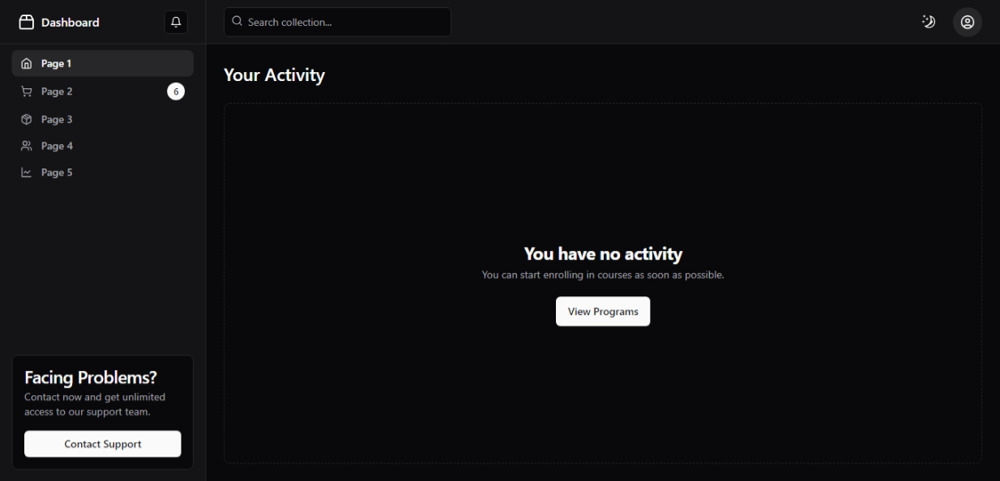
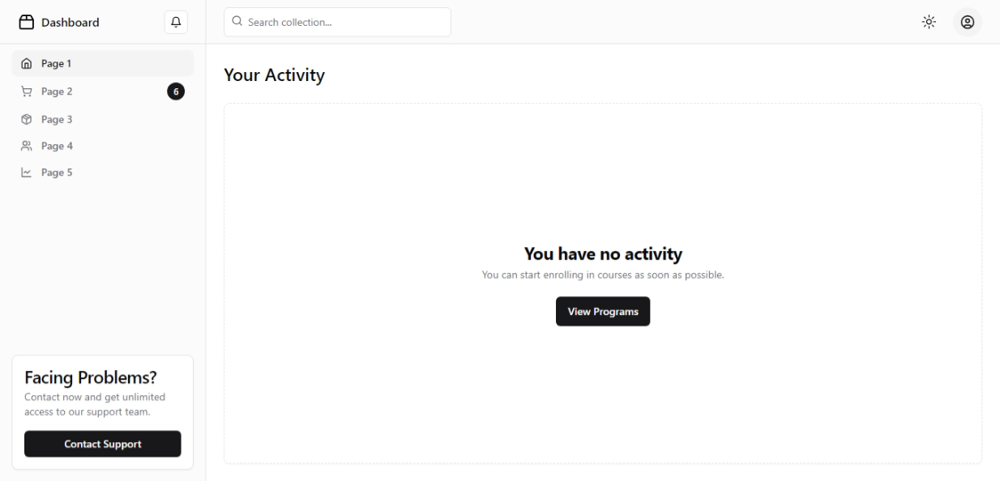

# Shadcn VITE Boilerplate

A boilerplate to kickstart your project using Shadcn in VITE with pure JavaScript (No TypeScript). This setup provides a robust foundation for developing modern web applications with an optimized build process and development environment.

## Features

- VITE for fast builds and hot module replacement
- Shadcn for component styling and theming
- Pure JavaScript for simplicity and ease of use
- Demo dashboard that works with react-router-dom
- Mode toggle, which supports dark & light mode

## Installation

To get started with this boilerplate, follow these steps:

1. **Clone the repository:**
   ```bash
   git clone https://github.com/iamDyeus/shadcn-vite-javascript-boilerplate.git
   ```

2. **Navigate to the project directory:**
   ```bash
   cd shadcn-vite-javascript-boilerplate
   ```

3. **Install dependencies:**
   ```bash
   npm install
   ```

4. **Run the development server:**
   ```bash
   npm run dev
   ```

5. **Build the project for production:**
   ```bash
   npm run build
   ```


## Demo

Here's a screenshot of the current template dashboard:



## Contributing

Contributions are welcome! If you have any ideas or suggestions to improve this boilerplate, feel free to open an issue or submit a pull request.

## License

This project is licensed under the MIT License. See the [LICENSE](LICENSE) file for more details.

## Acknowledgements

- [VITE](https://vitejs.dev/)
- [Shadcn](https://ui.shadcn.com/)

---

Happy coding!
